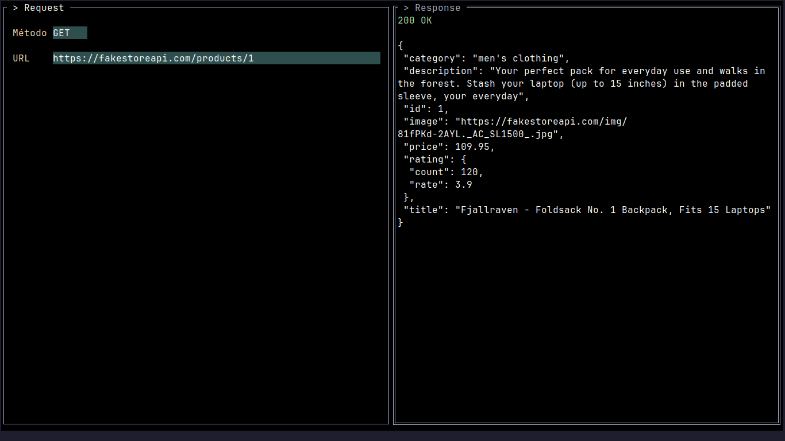

 


<h1 style="text-align: center">TUI HTTP Client</h1>

Este proyecto es un cliente HTTP con Interfaz de Usuario en Terminal (TUI) construido con Go, que utiliza las librerías `tview` y `tcell` para la interfaz de usuario, y el paquete estándar `net/http` para realizar las peticiones HTTP.

## Características

* **Selección de Método HTTP**: Permite elegir entre los métodos `GET`, `POST`, `PUT` y `DELETE` mediante un menú desplegable.
* **Entrada de URL**: Introduce la URL de destino para tu petición HTTP.
* **Cuerpo de la Petición**: Proporciona un cuerpo para la petición, típicamente en formato JSON.
* **Cabeceras**: Añade cabeceras personalizadas a tu petición. La función `ParseHeader` se encarga de analizar cadenas de cabeceras como `"x-api-key: 123; Auth: bearer 123123123"`, ignorando las líneas que comienzan con `#`.
* **Parámetros de Consulta (Query Parameters)**: Define parámetros de consulta para tu URL. La función `QueryParams` proporciona un área de texto para la entrada.
* **Parámetros de Ruta (Path Parameters)**: Especifica parámetros de ruta que se añadirán a la URL. La función `PathParams` proporciona un área de texto para la entrada.
* **Visualización de la Respuesta**: Muestra la respuesta HTTP, incluyendo el código de estado y el cuerpo, con resaltado de sintaxis para las respuestas JSON.
* **Coloreado de Códigos de Estado**: Los códigos de estado HTTP se colorean para una identificación rápida:
    * `1xx` (Información): Blanco
    * `2xx` (Éxito): Verde
    * `3xx` (Redirección): Amarillo
    * `4xx`/`5xx` (Error de Cliente/Servidor): Rojo
* **Navegación**: Cambia fácilmente entre las vistas de Body, Query Params, Path Params, Headers y Response usando botones dedicados.
* **Página de Ayuda**: Accede a una página de ayuda pulsando `F1` para ver los atajos de teclado para la navegación y el modo de pantalla completa.
* **Modo Pantalla Completa**: Alterna la pantalla completa para la vista de respuesta usando `Alt+F`.

## Cómo Usar

### Prerequisitos

* Go (se recomienda la versión 1.18 o superior)

### Ejecutar la Aplicación

1.  **Clona el repositorio**:
    ```bash
    git clone https://github.com/Lauta-dev/go-http_client-tui.git
    cd go-http_client-tui
    ```
2.  **Ejecuta la aplicación**:
    ```bash
    go run .
    ```
    Alternativamente, puedes construir y luego ejecutar:
    ```bash
    go build -o http-client
    ./http-client
    ```

### Resumen de la Interfaz

La TUI se divide en varias secciones:

* **Parte Superior Izquierda**: Menú desplegable para el método HTTP y campo de entrada de URL.
* **Parte Inferior Izquierda**: Botones para cambiar entre las diferentes secciones de entrada (Body, Query Params, Path Param, Headers).
* **Panel Derecho**: Muestra la respuesta de la petición HTTP, incluyendo el código de estado y el cuerpo.

### Atajos de Teclado

* **F1**: Alternar la página de Ayuda.
* **Alt+F**: Alternar la pantalla completa para la vista de respuesta.
* **Alt+B**: Cambiar a la vista de Body.
* **Alt+Q**: Cambiar a la vista de Query Params.
* **Alt+P**: Cambiar a la vista de Path Param.
* **Alt+H**: Cambiar a la vista de Headers.
* **Alt+D**: Enviar Petición.

## Dependencias

Este proyecto utiliza los siguientes módulos externos de Go:

* `github.com/rivo/tview`: Para construir la interfaz de usuario de la terminal.
* `github.com/gdamore/tcell/v2`: Una potente librería de UI de terminal basada en celdas utilizada por `tview`.
