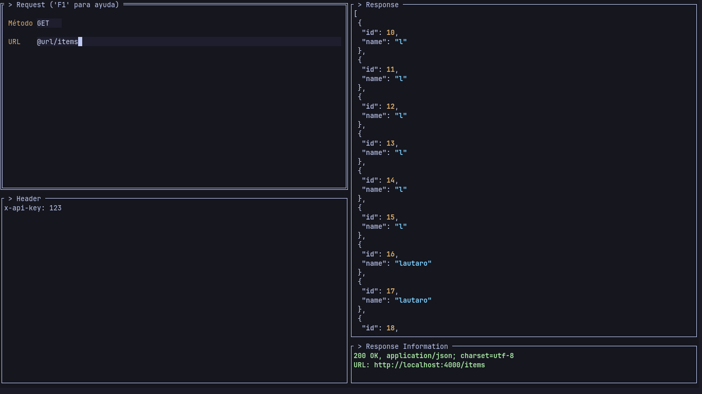

<h1 align="center">HTTPTUI</h1>

 
[](https://golang.org/)

Un cliente HTTP moderno con **Interfaz de Usuario en Terminal (TUI)** construido con Go. Realiza peticiones HTTP de forma visual e intuitiva desde la terminal.

> Nota importante: Este es un proyecto simple y básico que no incluye la capacidad de enviar archivos. Está diseñado para realizar peticiones HTTP estándar con texto plano, JSON y otros formatos de datos simples.

## Características

- **Métodos HTTP**: GET, POST, PUT, DELETE
- **Interfaz Visual**: Navegación intuitiva con colores
- **Gestión Completa**: Body, Headers, Query Params, Path Params
- **Códigos de Estado Coloreados**: Verde (2xx), Amarillo (3xx), Rojo (4xx/5xx)
- **Resaltado JSON**: Respuestas formateadas automáticamente
- **Atajos de Teclado**: Control completo sin mouse
- **Modo Pantalla Completa**: Maximizar vista de respuesta
- **Soporte para variables**: Se puede cargar usando --env-file o -env-file

## Comandos CLI
- **--env-file** | **-env-file**: Importa un archivo `.env`
- **--help** | **-help**: Muestra la ayuda
-- **--activate-history** | **-activate-history**: Guarda las peticiones 

## Instalación

```bash
# Clonar y ejecutar
git clone https://github.com/Lauta-dev/go-http_client-tui.git
cd go-http_client-tui
go run .

# O compilar
go build -o http-client .
./http-client
```

## Controles

| Tecla | Acción |
|-------|--------|
| `F1` | Ayuda |
| `F2` | Peticiones |
| `F3` | Pestañas |
| `Alt+F` | Pantalla completa |
| `Alt+B` | Vista Body |
| `Alt+Q` | Vista Query Params |
| `Alt+P` | Vista Path Params |
| `Alt+H` | Vista Headers |
| `Alt+J` | Vista Variables |
| `Alt+I` | Vista formulario |
| `Alt+D` | Enviar petición |
| `Alt+N` | Copiar respuesta al portapapeles (X11 y Wayland) |
| `Ctrl+C` | Salir |

### Controles para la pestaña de peticiones
| Tecla | Acción |
|-------|--------|
| `u` | Actualizar lista |
| `d` | Eliminar elemento |
| `j` | Cambiar a la vista de lista |
| `k` | Cambiar a la vista de response |

### Controles para la pestaña de sesiones
| Tecla | Acción |
|-------|--------|
| `e` | Editar nombre de la sesion |
| `esc` | Saliar de la vista para editar |
| `x` | Eliminar item de la lista |

## Uso Rápido

### Petición GET
1. Seleccionar `GET`
2. URL: `https://jsonplaceholder.typicode.com/posts/1`
3. `Alt+D` para enviar

### Petición POST
1. Seleccionar `POST`
2. URL: `https://jsonplaceholder.typicode.com/posts`
3. Body (`Alt+B`):
   ```json
   {
     "title": "test",
     "body": "content",
     "userId": 1
   }
   ```
4. Headers (`Alt+H`):
   ```
   Content-Type: application/json
   ```
5. `Alt+D` para enviar

### Formato de Headers
```
Content-Type: application/json
Authorization: Bearer token-here
x-api-key: your-key
# Esta línea será ignorada
```

## Tecnologías

- **[tview](https://github.com/rivo/tview)** - Framework TUI
- **[tcell](https://github.com/gdamore/tcell)** - Terminal handling
- **[chroma](https://github.com/alecthomas/chroma)** - Colores en las respuestas
- **[gohtml](https://github.com/yosssi/gohtml)** - Dar formato al HTML
- **net/http** - Cliente HTTP nativo

## Contribución

1. Fork el repositorio
2. Crea tu rama (`git checkout -b feature/nueva-caracteristica`)
3. Commit (`git commit -am 'Añade nueva característica'`)
4. Push (`git push origin feature/nueva-caracteristica`)
5. Abre un Pull Request

---

⭐ **¡Dale una estrella si te gusta el proyecto!**
